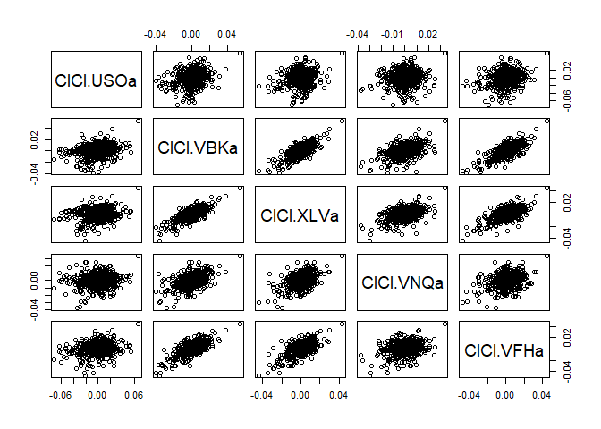
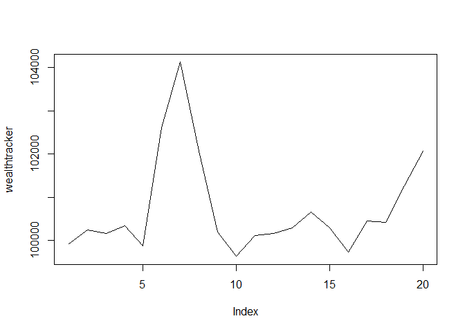
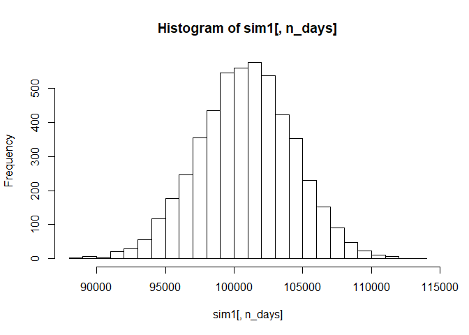
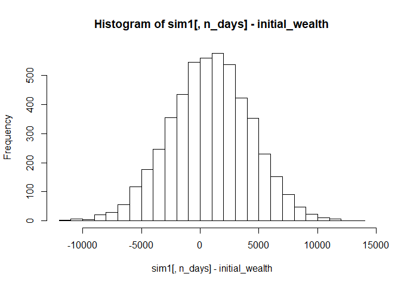

STA380 Exercises
================

**Kevin Brill, Ananya Garg, Hannah Ho, Shane Kok**

Below are the results of our team’s work on Dr. Scott’s STA380
Predictive Modeling exercises.

Visual Story Telling Part 1: Green Buildings
--------------------------------------------

    library(mosaic)

    green = read.csv('./data/greenbuildings.csv')

Visual Story Telling Part 2: Flights at ABIA
--------------------------------------------

    library(mosaic)
    library(tidyverse)

    month_arrival_avg=read.csv('./data/Month-Arrival-Avg.csv')
    month_dep_avg=read.csv('./data/Month-Departure-Avg.csv')

    months=c('1','2','3','4','5','6','7','8','9','10','11','12')

    ggplot(data = month_dep_avg) + 
      geom_col(mapping = aes(x = Month, y = DepDelay)) + 
      facet_wrap(~ UniqueCarrier, nrow = 5)+
      labs(title = "Carrier Average Departure Delays by Month")+
      scale_x_discrete(name='Month',limits=months)

    ggplot(data = month_arrival_avg) + 
      geom_col(mapping = aes(x = Month, y = ArrDelay)) + 
      facet_wrap(~ UniqueCarrier, nrow = 5)+ 
      labs(title = "Carrier Average Arrival Delays by Month")+
      scale_x_discrete(name='Month',limits=months)

Portfolio Modeling
------------------

    ##            USO.Open USO.High USO.Low USO.Close USO.Volume USO.Adjusted
    ## 2017-01-03    11.98    12.00   11.36     11.44   36183500        11.44
    ## 2017-01-04    11.42    11.63   11.36     11.58   18067800        11.58
    ## 2017-01-05    11.69    11.79   11.51     11.70   21346700        11.70
    ## 2017-01-06    11.76    11.81   11.62     11.68   15279600        11.68
    ## 2017-01-09    11.52    11.53   11.30     11.31   20055400        11.31
    ## 2017-01-10    11.37    11.37   11.07     11.07   23861600        11.07

    ##               ClCl.USOa    ClCl.VBKa   ClCl.XLVa     ClCl.VNQa
    ## 2017-01-03           NA           NA          NA            NA
    ## 2017-01-04  0.012237762  0.017107373 0.007875187  0.0146135140
    ## 2017-01-05  0.010362694 -0.004774102 0.005114377  0.0032138673
    ## 2017-01-06 -0.001709402 -0.001180841 0.002826813  0.0001186758
    ## 2017-01-09 -0.031678082 -0.001034424 0.004228372 -0.0090165143
    ## 2017-01-10 -0.021220159  0.005991110 0.003508772 -0.0084999283
    ##               ClCl.VFHa
    ## 2017-01-03           NA
    ## 2017-01-04  0.011204047
    ## 2017-01-05 -0.010914503
    ## 2017-01-06  0.004012673
    ## 2017-01-09 -0.008492889
    ## 2017-01-10  0.004534766

    ## [1] 102060.3

    ##               [,1]      [,2]      [,3]      [,4]      [,5]      [,6]
    ## result.1 100054.02 100982.20 103142.08 102276.44 102159.50 101925.18
    ## result.2  98782.75  99163.52  98874.01  97769.16  98015.32  98260.97
    ## result.3 100044.58  99938.58  99685.81 100284.05 100092.65  99720.37
    ## result.4  99391.97  99760.37  99449.45 100219.87  99756.27  99876.26
    ## result.5 100299.39 101481.60 101619.50 101467.26 101197.79  99898.59
    ## result.6  99739.92  98981.45 100244.42  99923.35  99782.30  99034.63
    ##               [,7]      [,8]      [,9]     [,10]     [,11]     [,12]
    ## result.1 101611.25 103275.47 103451.16 103684.29 103275.46 103577.77
    ## result.2  98443.59  97976.10  98517.26  98082.57  98058.80  98791.04
    ## result.3  98959.86  99607.57  98958.91 100038.76  99836.22  99181.06
    ## result.4  99977.69 100369.53 100535.43 100803.54 101197.54 102465.51
    ## result.5  98922.84  98273.72  98335.89  98264.11  96758.87  96995.51
    ## result.6  98657.78  98923.30  99106.57  99617.25  99400.56  99970.99
    ##              [,13]     [,14]     [,15]     [,16]     [,17]     [,18]
    ## result.1 103564.95 105112.90 104538.97 104208.69 104139.12 104289.76
    ## result.2  98123.27  98487.45  99412.13  99477.23 100761.47 100398.81
    ## result.3  98891.16  99085.58  99125.70  99741.45  99841.23 100209.56
    ## result.4 102148.55 102233.23 100942.04  99144.43  99408.91  99169.99
    ## result.5  97885.66  97871.83  99030.36  99213.78  99148.26 100522.43
    ## result.6 101004.75 101183.53 100831.40 101379.88 101932.22 100063.80
    ##              [,19]     [,20]
    ## result.1 104478.87 103710.57
    ## result.2  99357.06  99951.57
    ## result.3  99748.81 100445.16
    ## result.4  99026.71  98900.78
    ## result.5 102178.37 103163.50
    ## result.6 100290.84  99829.43

    ## [1] 100856.7

VaR stands for value at risk, and this metric shows the risk of loss for
an investment on a distribution. We calculated the VaR distribution for
three different types of portfolios were tested for our portfolio
modeling: a balanced, an aggressive, and a conservative portfolio.

The aggressive portfolio is composed of small cap growth stock ETF’s,
which means that it is focused on smaller stocks with potential. This is
more risky because small cap companies have a larger chance of going
under and are less stable than their large cap stock counterparts. As
expected, the 5% VaR for the aggressive portfolio is the worst and is
-$8000.

The conservative portfolio is mainly made up of different types of bond
and money market ETF’s, which are one of the safest types of investments
you can make on the financial market. Many of these are either mortgage
or government backed bonds, therefore they are collateralized and this
limits your risk significantly. The 5% VaR for the conservative
portfolio is the best and is only -$1000.

The balanced portfolio contains a wide range of financial products from
across the spectrum. These products contain ETF’s from a wide range of
industries, such as oil and real estate. This spectrum of different
industries helps to balance out the portfolio, and mostly Vanguard
products were chosen for their strong returns and good past performance,
in order to help balance out the risk of this portfolio. A healthcare
ETF is super stable as well, which is why one of these ETF’s was
included in the portfolio too. The 5% VaR for the balanced portfolio is
about -$5000.

The VaR distributions for each portfolio came out as expected, with the
conservative portfolio being the least risky and the aggressive
portfolio being the most.

Market Segmentation
-------------------

Author Attribution
------------------

Our analysis of the author text data consisted of the following
framework:

**1. Preprocessing of the training set**

**2. Preprocessing of the test set**

**3. PCA setup to allow for dimension reduction during modeling**

**4. Modeling and results**

**5. Further considerations**

Below, we dive into our processes for each of the above items.

##### 1. PREPROCESSING OF THE TRAINING SET

This section contains the bulk of the work done for this problem. We
began by reading in the raw .txt files and extracting a list of all
documents and a list of all author names in the training set. We then
used the list of .txt files to construct the corpus for our problem.
From this corpus, we convert all letters into lower case, remov all
numbers; punctuation; and whitespaces, and delete all occurances of
words that are contained in R’s “SMART” stopwords dictionary. With the
corpus fully cleaned, we create a DTM out of the corpus and remove all
words that appear in only 2.5% of documents or fewer. In doing so, we
guarantee that these rare words won’t be given excessive weight in our
models and skew our results. Finally, we replace the contents of our DTM
with the TF-IDF weights of each word rather than simply their counts.

##### 2. PREPROCESSING OF THE TEST SET

In this section, we follow the same processes of the above section on
the test set of documents, all the way up until we create the DTM. Here,
we limit the dictionary of the test set’s DTM to the words contained in
the training set’s DTM dictionary. In doing so, we ensure that both the
training and testing sets’ DTMs consist of the same set of columns when
we begin modeling. Finally, we replace the contents of the test DTM with
the TF-IDF weights of each word (same as above section).

##### 3. PCA SETUP TO ALLOW FOR DIMENSION REDUCTION DURING MODELING

Here, we find the PCAs of the training and testing sets. We find that
the first 600 principal components explain ~80% of the variance in the
training set so we proceed with the first 600 principal components.

##### 4. MODELING AND RESULTS

We obtain results for variations of two types of models: KNN and Random
Forest. The prediction accuracies for each variant are listed below:

**KNN with cosine distance:** 55.24%

**KNN with cosine distance of first 600 principal components:** 58.08%

**Random Forest:** 60.48%

**Random Forest on first 600 principal components:** 55.28%

**Random Forest with m=sqrt(p):** 62.36%

As can be seen from the results above, our random forest model with
m=sqrt(p)=37 and no dimensionality reduction yielded the best
classification accuracy at 62.36% of articles attributed to the correct
author.

##### 5. FURTHER CONSIDERATIONS

Our team tried to use Naive Bayes and BART to classify the articles, but
ran into errors that took too long to debug before the deadline of this
assignment. It is likely that these modeling techniques would outperform
our above models.

Further, the best way to improve our classification accuracies would be
to have more robust preprocessing. For example, we could create a dummy
“unknown” variable in our test DTM that would count the number of words
that show up in our test set that didn’t appear in our training set. Our
above test DTM simply ignore new words in the test set, which likely
decreases performance. We could also consider n-gram groupings of words
for more nuanced TF-IDF values in our DTMs.

Association Rule Mining
-----------------------

    ## Apriori
    ## 
    ## Parameter specification:
    ##  confidence minval smax arem  aval originalSupport maxtime support minlen
    ##         0.5    0.1    1 none FALSE            TRUE       5    0.01      1
    ##  maxlen target   ext
    ##       3  rules FALSE
    ## 
    ## Algorithmic control:
    ##  filter tree heap memopt load sort verbose
    ##     0.1 TRUE TRUE  FALSE TRUE    2    TRUE
    ## 
    ## Absolute minimum support count: 98 
    ## 
    ## set item appearances ...[0 item(s)] done [0.00s].
    ## set transactions ...[169 item(s), 9835 transaction(s)] done [0.00s].
    ## sorting and recoding items ... [88 item(s)] done [0.00s].
    ## creating transaction tree ... done [0.00s].
    ## checking subsets of size 1 2 3 done [0.00s].
    ## writing ... [15 rule(s)] done [0.00s].
    ## creating S4 object  ... done [0.00s].

    ##      lhs                     rhs                   support confidence     lift count
    ## [1]  {curd,                                                                         
    ##       yogurt}             => {whole milk}       0.01006609  0.5823529 2.279125    99
    ## [2]  {butter,                                                                       
    ##       other vegetables}   => {whole milk}       0.01148958  0.5736041 2.244885   113
    ## [3]  {domestic eggs,                                                                
    ##       other vegetables}   => {whole milk}       0.01230300  0.5525114 2.162336   121
    ## [4]  {whipped/sour cream,                                                           
    ##       yogurt}             => {whole milk}       0.01087951  0.5245098 2.052747   107
    ## [5]  {other vegetables,                                                             
    ##       pip fruit}          => {whole milk}       0.01352313  0.5175097 2.025351   133
    ## [6]  {citrus fruit,                                                                 
    ##       root vegetables}    => {other vegetables} 0.01037112  0.5862069 3.029608   102
    ## [7]  {root vegetables,                                                              
    ##       tropical fruit}     => {other vegetables} 0.01230300  0.5845411 3.020999   121
    ## [8]  {root vegetables,                                                              
    ##       tropical fruit}     => {whole milk}       0.01199797  0.5700483 2.230969   118
    ## [9]  {tropical fruit,                                                               
    ##       yogurt}             => {whole milk}       0.01514997  0.5173611 2.024770   149
    ## [10] {root vegetables,                                                              
    ##       yogurt}             => {other vegetables} 0.01291307  0.5000000 2.584078   127
    ## [11] {root vegetables,                                                              
    ##       yogurt}             => {whole milk}       0.01453991  0.5629921 2.203354   143
    ## [12] {rolls/buns,                                                                   
    ##       root vegetables}    => {other vegetables} 0.01220132  0.5020921 2.594890   120
    ## [13] {rolls/buns,                                                                   
    ##       root vegetables}    => {whole milk}       0.01270971  0.5230126 2.046888   125
    ## [14] {other vegetables,                                                             
    ##       yogurt}             => {whole milk}       0.02226741  0.5128806 2.007235   219

Write-up here
